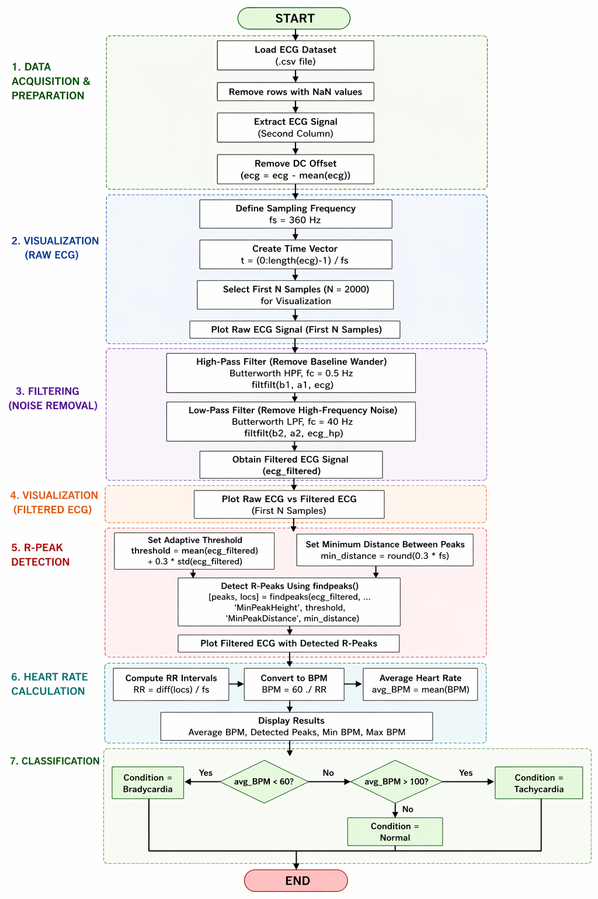
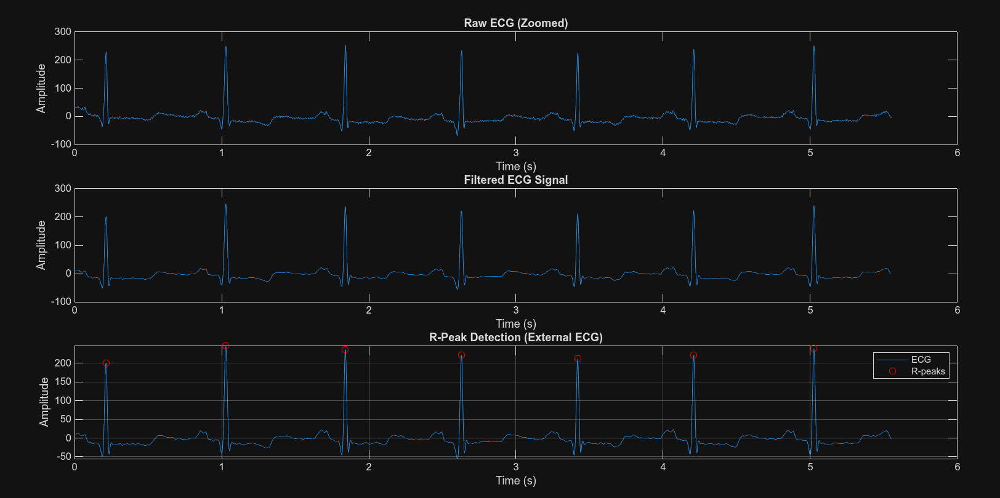

# ECG Signal Processing using MATLAB

This project demonstrates basic ECG signal processing, including filtering, R-peak detection, heart rate calculation (BPM), and classification into Normal, Tachycardia, or Bradycardia.

---

## Project Structure

```text
Test.mlx
ECG_Signal_Processing_and_Heart_Rate_Analysis_using_MATLAB.mlx
Bradycardia_Generating.mlx
Data Analytics/
    ├── 100.csv
    ├── 102.csv
    ├── ...
```

---

## Description of Files

### 1. Test.mlx

* Uses MATLAB built-in sample ECG (`ecg.mat`)
* Demonstrates full pipeline:

  * Filtering
  * R-peak detection
  * BPM calculation
  * Classification

👉 Purpose: **Baseline testing and understanding**

---

### 2. ECG_Signal_Processing_and_Heart_Rate_Analysis_using_MATLAB.mlx

* Uses external dataset (`100.csv`)
* Applies:

  * Noise removal (0.5–40 Hz filtering)
  * Peak detection using `findpeaks()`
  * BPM calculation
  * Classification

👉 Purpose: **Real dataset processing**

---

### 3. Bradycardia_Generating.mlx

* Simulates bradycardia by modifying ECG signal timing
* Demonstrates low heart rate condition

👉 Purpose: **Controlled scenario generation**

---

## Methodology



1. Load ECG signal
2. Remove DC offset
3. Apply filtering:

   * High-pass (0.5 Hz)
   * Low-pass (40 Hz)
4. Detect R-peaks
5. Compute RR intervals
6. Calculate BPM
7. Classify condition

---
## Mathematical Representation 

Let the ECG signal be represented as a discrete-time signal:
x[n] → Raw ECG Signal

1. DC Offset Removal:
   x_dc[n] = x[n] − μ  
   where μ = (1/N) Σ x[n]

2. Bandpass Filtering (0.5–40 Hz):
   y[n] = x[n] * h[n]  
   (removes baseline drift and high-frequency noise)

3. R-Peak Detection:
   T = μ + 0.3σ  
   Peak condition:
   x[n] > x[n−1] and x[n] > x[n+1], and x[n] ≥ T

4. RR Interval:
 RR = (n₂ − n₁) / f_s

5. Heart Rate (BPM):
 BPM = 60 / RR

6. Classification:
 HR < 60 → Bradycardia 
 60–100 → Normal 
 HR > 100 → Tachycardia


---

## Output

* ECG waveform visualization
* Filtered signal
* R-peak detection plot
* Heart rate (BPM)
* Condition classification



---

## Dataset

* Source: MIT-BIH Arrhythmia Database (PhysioNet)
* Format: Converted to CSV
* Sampling Frequency: 360 Hz

---

## Important Note

This project is developed for **educational and learning purposes only**.

* It demonstrates signal processing techniques applied to ECG data
* It is **not a medically validated system**
* It should **not be used for diagnosis or clinical decision-making**

The dataset used is publicly available research data, and any generated conditions (such as bradycardia) are **simulated for demonstration purposes only**.

---

## Author

Dinesh Ramineni
